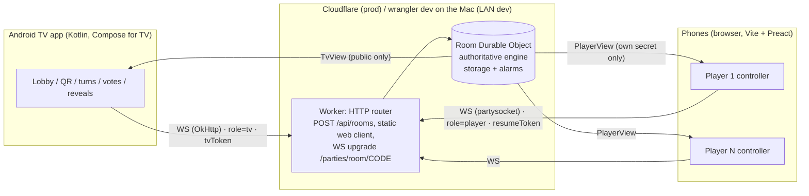
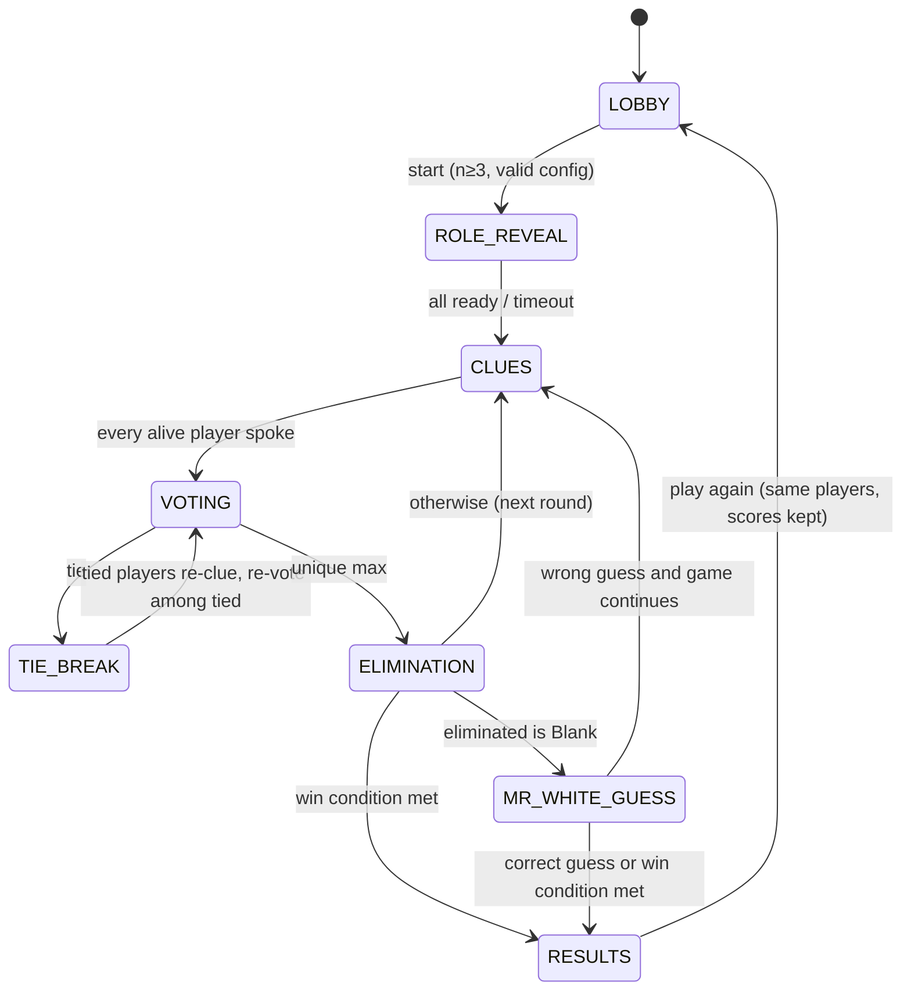

# PLAN — Mish Ana! (working title)

The decisions behind this plan and their sources are in [RESEARCH.md](RESEARCH.md).

## 1. Architecture



- **The server is authoritative.** Clients only send intents. The DO runs `engine.reduce(state, action, rng)` and then sends each connection its own view, built by `projectForTv(state)` or `projectForPlayer(state, playerId)`.
- **The engine is pure** (in `/shared`): there is no I/O, time and randomness are injected, and the same seed plus the same actions always give the same state. It runs unchanged in the DO, in Vitest, and in the CLI simulator.

## 2. Monorepo layout (pnpm workspaces)

```
/shared        TS: engine (state machine), protocol types (zod), view projection, i18n JSON, word-pack schema
/server        TS: Cloudflare Worker + Room DO (partyserver), wrangler.jsonc, rate limiting
/web-client    TS: Vite + Preact phone controller, plus /tv-mock (browser TV view for M2)
/tv-app        Kotlin: Gradle project (AGP 9.4, Compose for TV)
/word-packs    JSON packs per locale + validator
/tools         CLI simulator, strings.xml generator, pack linter
/docs          RESEARCH.md, PLAN.md, PRIVACY.md, release checklist
```

**Dev commands.** `pnpm dev` runs `wrangler dev --ip 0.0.0.0` and `vite --host` at the same time. `LAN_HOST` is detected automatically, can be overridden through `.env`, and is printed together with the join URL. The TV app's debug build reads the server URL from a `BuildConfig` field set with `-PserverUrl=`, and can also be changed from a hidden debug settings screen.

**Pinned versions:** TS 5.x strict, wrangler 4.147.0, partyserver 0.5.10, partysocket 1.3.0, preact 10.29.8, vite 8.3.2, vitest, zod. Exact versions are written in the lockfile and the Gradle version catalog.

## 3. Game state machine



- **State** is one serialisable object: `{phase, settings, players[{id,name,color,role,word,alive,connected,seat}], round, speakingOrder, turnIdx, votes, tieCandidates, deadline, history, scores, rngState}`.
- **Actions:**
  - Player actions: `JOIN`, `LEAVE`, `RECONNECT`, `UPDATE_SETTINGS`, `START`, `READY`, `CLUE_DONE`, `CAST_VOTE`, `SUBMIT_GUESS`, `HOST_OVERRIDE_GUESS`, `KICK`, `PLAY_AGAIN`.
  - System actions: `TIMER_EXPIRED`, `DISCONNECT`.
- **Timers:** the engine sets `deadline`, and the DO sets a storage alarm, which dispatches `TIMER_EXPIRED`. Stale alarms are ignored by comparing `deadlineId`.
- **Tests (Vitest), all required to pass in M1:**
  - unit tests for every transition;
  - property tests with fast-check: random games always terminate, the role counts are respected, and a secret never appears in the TV projection;
  - golden snapshots of seeded full games;
  - a matrix of win-rule edge cases for 3–12 players.

## 4. Realtime protocol

Transport: WebSocket carrying JSON. Each message is `{v:1, t:"<type>", ...}`. The message shapes are zod schemas in `/shared/protocol`. The Kotlin `@Serializable` classes mirror those schemas, and both sides test against the same JSON fixtures in `/shared/fixtures`.

| Direction | Type | Payload |
|---|---|---|
| TV → HTTP | `POST /api/rooms` | → `{code, tvToken, joinUrl}` |
| C → S | `hello` | `{role:"tv", tvToken}` or `{role:"player", resumeToken?}` |
| C → S | `join` | `{name, color, locale}` (player only) |
| C → S | `action` | `{a: Action}` (validated; the server checks who is allowed to do what) |
| S → C | `welcome` | `{playerId, resumeToken}` (player) |
| S → C | `state` | `{seq, view: TvView \| PlayerView}`, a full snapshot every time (the state is under 5 KB) |
| S → C | `error` | `{code, messageKey}` |
| either | `ping` / `pong` | app-level heartbeat every 20 s |

**Identities**
- **Room code:** 4 characters from `ABCDEFGHJKMNPQRSTUVWXYZ`, mapped to a DO with `idFromName(code)`. The DO is created by the TV's request, so it is placed near the host. If the code collides with an active room, a new code is drawn.
- **`playerId`:** random 96-bit. **`resumeToken`:** random 128-bit, stored on the phone in localStorage under the room code. **`tvToken`:** random 128-bit, kept in the TV app's memory and in the DO.

**Who sees what**
- **TvView:** phase, players (name, colour, alive, connected, has-voted, revealed role for eliminated players only), speaker and timer, vote tallies after the reveal, scores.
  - **Never sent to the TV:** words, roles of living players, or votes in progress.
  - The two words are sent to the TV only in `RESULTS`.
- **PlayerView:** the TvView plus only that player's own `word`. The Blank gets `word: null`. The role itself is included only if `revealRoles` is on.
- The Blank's typed guess is checked on the server. Clients only ever receive `correct: bool`.

**Lifetimes:**
- A room expires after 15 min in an empty lobby, after 2 h of inactivity, or 30 min after `RESULTS` with no play-again. Expiry is enforced by an alarm, which deletes storage.
- A disconnected player's seat is held for 120 s. While they're away, their turn is skipped and their vote is counted as an abstention.

## 5. Security
- **Secrets stay on the server.** Words never reach the TV or other phones. A CI test checks that serialised `TvView` and other players' `PlayerView`s contain neither secret word, using fixtures across 1,000 seeded games.
- **Rate limits:**
  - Room creation: 10/min per IP, enforced by a Workers rate-limiting binding or a small `Limiter` DO. The exact API will be checked against the docs in M1.
  - Joins and actions: per-connection token bucket in the room DO, 20 msgs/s, joins limited to 5/min per IP per room.
  - Room size: max 12 players; names ≤16 characters, sanitised.
- **Room codes are short-lived (see lifetimes above).** Rooms lock when the game starts: no new joins, reconnects only.
- **Tokens and data:**
  - Tokens are compared in constant time and never logged.
  - No accounts and no personal data beyond the nickname. Rooms are deleted when they expire, so the privacy policy can be simple.
- **Transport and origins:** production uses `wss` only. Debug cleartext is allowed only in the `src/debug` network config. WebSocket upgrades require an `Origin` allowlist for browsers. The TV, being a native app, uses `tvToken` instead.

## 6. Milestones

| # | Scope | Acceptance criteria |
|---|---|---|
| **M1** | `/shared` engine + protocol + projections; `/server` Worker + Room DO; `/tools/sim` CLI | `pnpm test` is green, with ≥90% branch coverage on the engine. `pnpm sim --players 3..12 --games 500` finishes every game with no invariant failures. The secret-leak test passes. `pnpm dev` starts wrangler, a scripted WS client can play a full game against it, and a reconnect with a resume token restores the seat |
| **M2** | Phone web client + browser TV mock | On a real phone on the LAN: scan the QR shown by the TV mock, join, hold to see the word, take clue turns, vote, have the Blank guess, see results. Locking the phone for 60 s and unlocking it resumes the game. Wake lock works on Android Chrome. Bundle is ≤60 KB gzip excluding fonts. Playwright e2e covers a 4-player game |
| **M3** | Android TV app | Runs on the Google TV emulator (API 34+) and on the TCL via `adb connect`. Lobby with QR and code. The full game flow is usable with the D-pad only. Back behaves per TV-DB. No clipping at 48/27 dp margins. Reconnects after Wi-Fi drops. Documented commands: `./gradlew :app:installDebug -PserverUrl=http://<mac-ip>:8787` |
| **M4** | i18n FR/EN/AR + RTL; word packs; polish | All screens in 3 languages on TV and phone, with RTL mirrored correctly (screenshot tests for AR). Packs: EN ≥150, FR ≥150, AR ≥100 including a Lebanese pack ≥40, all lint-clean. Sounds (with mute), reveal animations, configurable timers, Blank-guess matching with Arabic normalisation |
| **M5** | Play Store readiness | Banners (localised, name included), icon, TV screenshots, privacy policy page, quality checklist doc with every TV-* item ticked, signed release AAB under a Play App Signing setup, production deploy to Cloudflare with a custom domain, internal-testing track upload instructions |

Each milestone ends with tests and builds green, a short report, and ⛔ a stop for your approval.

## 7. Risks
| Risk | Mitigation |
|---|---|
| DO hibernation drops in-memory state or timers | All state goes through `ctx.storage` and alarms; a test hibernates the DO mid-game in `wrangler dev` |
| iOS Safari backgrounding kills sockets | Full-snapshot resync, a 120 s seat hold, and timers that skip absent players |
| Kotlin and TS protocol types drift apart | Shared JSON fixtures tested on both sides, and a version field `v` in every message |
| Arabic word quality, sensitive pairs | Native-speaker review, `ageRating` labels, a family filter |
| Play TV review rejection | Follow the TV-* checklist from M3 on; internal track first |
| Name conflict or trademark | Formal searches before the M5 listing; the name is a single constant and asset set, so it's easy to change |
| Phones and TV on different networks or guest Wi-Fi in prod | Production goes through the cloud, so this only matters for LAN dev; documented |

## 8. Open questions for you
1. **Win rule.** Should the default be the official rule (infiltrators win at ≤1 Civilian alive) or the parity rule from your brief (infiltrators ≥ Civilians)? Both will be implemented as a setting. *My recommendation: official.*
2. **Role secrecy.** Should Civilians and Undercovers be told their role? The official app doesn't tell them, and I'd keep it that way, with a "beginner mode" option that does.
3. **Name.** Go with **Mish Ana!**, or one of the fallbacks?
4. **Production domain** for the QR URL, e.g. `play.mishana.app`, or `*.workers.dev` for now? I'll also need a Cloudflare account for deploys from M1/M2 onward; LAN dev works without one.
5. **Hosting the phone client.** I'd serve it from the same Worker as static assets, so there's one origin. OK?
6. **Your TCL model and its Android TV OS version.** This decides between `adb pair` and `adb tcpip`.
7. **A native Lebanese reviewer** for the AR packs: you, or someone else?
8. **Repo.** I can't rename `bubble-graph` from here; please rename it in GitHub settings. Also, pushing the tag `legacy-bubble-graph` failed with a 403; the old code is still reachable at commit `60c332d`.
